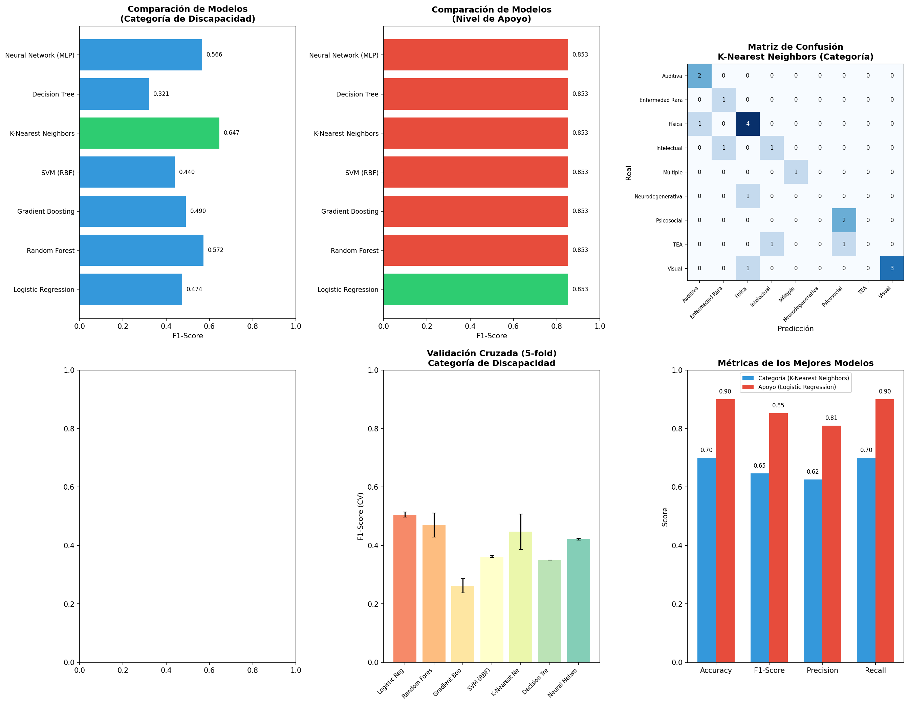

# ICF Computational Classifier

Sistema de clasificación computacional de discapacidad basado en la **Clasificación Internacional del Funcionamiento, de la Discapacidad y de la Salud (CIF)** de la Organización Mundial de la Salud (OMS).

---

## Tabla de Contenidos

- [Descripción del Problema](#descripción-del-problema)
- [Marco Teórico: La CIF](#marco-teórico-la-cif)
- [Dataset](#dataset)
- [Problemas de Clasificación](#problemas-de-clasificación)
- [Metodología](#metodología)
- [Resultados](#resultados)
- [Instalación y Uso](#instalación-y-uso)
- [Estructura del Proyecto](#estructura-del-proyecto)
- [Referencias](#referencias)

---

## Descripción del Problema

### Contexto

La evaluación de la discapacidad es un proceso complejo que requiere considerar múltiples dimensiones del funcionamiento humano. Tradicionalmente, esta evaluación se realiza de manera manual por equipos multidisciplinarios, lo que puede ser:

- **Subjetivo**: Dependiente del criterio del evaluador
- **Inconsistente**: Variabilidad entre evaluadores
- **Costoso**: Requiere tiempo y recursos especializados
- **Limitado**: Difícil de escalar a grandes poblaciones

### Objetivo

Desarrollar un **sistema de clasificación computacional** que permita:

1. **Predecir la categoría de discapacidad** de una persona basándose en sus calificadores CIF
2. **Determinar el nivel de apoyo requerido** según el perfil funcional
3. **Proporcionar una herramienta objetiva** de apoyo a la decisión clínica

### Aplicaciones Potenciales

| Área | Aplicación |
|------|------------|
| **Clínica** | Apoyo al diagnóstico y planificación de intervenciones |
| **Administrativa** | Asignación de recursos y servicios de rehabilitación |
| **Investigación** | Análisis de patrones en poblaciones con discapacidad |
| **Políticas públicas** | Planificación de servicios y detección de necesidades |

---

## Marco Teórico: La CIF

La **Clasificación Internacional del Funcionamiento, de la Discapacidad y de la Salud (CIF)** es el marco conceptual de la OMS para describir y medir la salud y la discapacidad.

### Componentes de la CIF

```
┌─────────────────────────────────────────────────────────────────────────┐
│                        CLASIFICACIÓN CIF                                │
├─────────────────────────────────────────────────────────────────────────┤
│                                                                         │
│  ┌─────────────────────────┐    ┌─────────────────────────────────┐    │
│  │   FUNCIONES CORPORALES  │    │     ESTRUCTURAS CORPORALES      │    │
│  │         (b1-b8)         │    │           (s1-s8)               │    │
│  ├─────────────────────────┤    ├─────────────────────────────────┤    │
│  │ b1: Mentales            │    │ s1: Sistema nervioso            │    │
│  │ b2: Sensoriales/dolor   │    │ s2: Ojo, oído y relacionadas    │    │
│  │ b3: Voz y habla         │    │ s3: Voz y habla                 │    │
│  │ b4: Cardiovascular      │    │ s4: Cardiovascular/respiratorio │    │
│  │ b5: Digestivo/endocrino │    │ s5: Digestivo/endocrino         │    │
│  │ b6: Genitourinarias     │    │ s6: Genitourinario              │    │
│  │ b7: Neuromusculares     │    │ s7: Movimiento                  │    │
│  │ b8: Piel                │    │ s8: Piel                        │    │
│  └─────────────────────────┘    └─────────────────────────────────┘    │
│                                                                         │
│  ┌─────────────────────────┐    ┌─────────────────────────────────┐    │
│  │ ACTIVIDADES/PARTICIPACIÓN│   │    FACTORES AMBIENTALES         │    │
│  │         (d1-d9)         │    │           (e1-e5)               │    │
│  ├─────────────────────────┤    ├─────────────────────────────────┤    │
│  │ d1: Aprendizaje         │    │ e1: Productos y tecnología      │    │
│  │ d2: Tareas generales    │    │ e2: Entorno natural             │    │
│  │ d3: Comunicación        │    │ e3: Apoyo y relaciones          │    │
│  │ d4: Movilidad           │    │ e4: Actitudes                   │    │
│  │ d5: Autocuidado         │    │ e5: Servicios y políticas       │    │
│  │ d6: Vida doméstica      │    │                                 │    │
│  │ d7: Relaciones          │    │                                 │    │
│  │ d8: Áreas principales   │    │                                 │    │
│  │ d9: Vida comunitaria    │    │                                 │    │
│  └─────────────────────────┘    └─────────────────────────────────┘    │
│                                                                         │
└─────────────────────────────────────────────────────────────────────────┘
```

### Sistema de Calificadores CIF

| Calificador | Descripción | Porcentaje de Afectación |
|:-----------:|-------------|:------------------------:|
| **0** | Sin problema | 0-4% |
| **1** | Problema leve | 5-24% |
| **2** | Problema moderado | 25-49% |
| **3** | Problema grave | 50-95% |
| **4** | Problema completo | 96-100% |

### Factores Ambientales (escala especial)

| Valor | Significado |
|:-----:|-------------|
| **-4 a -1** | Barrera (completa a leve) |
| **0** | Ni barrera ni facilitador |
| **+1 a +4** | Facilitador (leve a completo) |

---

## Dataset

### Descripción

Dataset simulado de **100 personas con discapacidad** generado siguiendo la estructura de la CIF.

### Características del Dataset

| Característica | Valor |
|----------------|-------|
| **Total de registros** | 100 |
| **Total de columnas** | 71 |
| **Features numéricas** | 32 |

### Variables del Dataset

#### Datos Demográficos (7 columnas)
- `id`: Identificador único
- `nombre_completo`: Nombre simulado
- `edad`: Edad (5-85 años)
- `sexo`: Masculino/Femenino
- `tipo_discapacidad`: 22 tipos diferentes
- `etiologia`: Origen de la discapacidad
- `fecha_evaluacion`: Fecha de evaluación

#### Funciones Corporales (16 columnas: 8 calificadores + 8 descripciones)
```
b1_funciones_mentales
b2_funciones_sensoriales_dolor
b3_funciones_voz_habla
b4_funciones_cardiovascular_respiratorio
b5_funciones_digestivo_metabolico_endocrino
b6_funciones_genitourinarias_reproductivas
b7_funciones_neuromusculoesqueleticas_movimiento
b8_funciones_piel
```

#### Estructuras Corporales (16 columnas)
```
s1_estructura_sistema_nervioso
s2_ojo_oido_estructuras_relacionadas
s3_estructuras_voz_habla
s4_estructura_cardiovascular_respiratorio
s5_estructuras_digestivo_metabolico_endocrino
s6_estructuras_genitourinario_reproductivo
s7_estructuras_movimiento
s8_piel_estructuras_relacionadas
```

#### Actividades y Participación (18 columnas)
```
d1_aprendizaje_aplicacion_conocimiento
d2_tareas_demandas_generales
d3_comunicacion
d4_movilidad
d5_autocuidado
d6_vida_domestica
d7_interacciones_relaciones_interpersonales
d8_areas_principales_vida
d9_vida_comunitaria_social_civica
```

#### Factores Ambientales (10 columnas)
```
e1_productos_tecnologia
e2_entorno_natural_cambios_humanos
e3_apoyo_relaciones
e4_actitudes
e5_servicios_sistemas_politicas
```

#### Índices Calculados (4 columnas)
- `indice_severidad_funcional`: Promedio de calificadores de funciones corporales
- `indice_limitacion_actividades`: Promedio de calificadores de actividades
- `indice_global_discapacidad`: Promedio general
- `nivel_apoyo_requerido`: Mínimo, Intermitente, Limitado, Extenso

---

## Problemas de Clasificación

### Problema 1: Clasificación de Categoría de Discapacidad

**Objetivo**: Predecir la categoría general de discapacidad basándose en los calificadores CIF.

```
                    ┌─────────────────────────────────────┐
                    │   CATEGORÍAS DE DISCAPACIDAD        │
                    ├─────────────────────────────────────┤
                    │  • Física (24%)                     │
                    │  • Visual (19%)                     │
                    │  • Auditiva (12%)                   │
                    │  • Psicosocial (12%)                │
                    │  • Intelectual (10%)                │
                    │  • TEA (8%)                         │
                    │  • Enfermedad Rara (7%)             │
                    │  • Neurodegenerativa (5%)           │
                    │  • Múltiple (3%)                    │
                    └─────────────────────────────────────┘
```

**Tipo de problema**: Clasificación multiclase (9 clases)

**Desafíos**:
- Clases desbalanceadas
- Superposición de características entre categorías
- Patrones complejos de interacción entre funciones

### Problema 2: Clasificación de Nivel de Apoyo Requerido

**Objetivo**: Predecir el nivel de apoyo necesario para la persona.

```
┌────────────────┬─────────────────────────────────────────────────────┐
│ Nivel          │ Descripción                                         │
├────────────────┼─────────────────────────────────────────────────────┤
│ Mínimo         │ Apoyo ocasional, independencia casi total           │
│ Intermitente   │ Apoyo en situaciones específicas                    │
│ Limitado       │ Apoyo regular en áreas específicas                  │
│ Extenso        │ Apoyo continuo en múltiples áreas                   │
└────────────────┴─────────────────────────────────────────────────────┘
```

**Tipo de problema**: Clasificación multiclase ordinal (4 clases)

---

## Metodología

### Pipeline de Procesamiento

```
┌─────────────┐    ┌─────────────┐    ┌─────────────┐    ┌─────────────┐
│   CARGAR    │───▶│  PREPARAR   │───▶│  ESCALAR    │───▶│  ENTRENAR   │
│   DATOS     │    │  FEATURES   │    │  DATOS      │    │  MODELOS    │
└─────────────┘    └─────────────┘    └─────────────┘    └─────────────┘
                                                                │
┌─────────────┐    ┌─────────────┐    ┌─────────────┐           │
│   GUARDAR   │◀───│  GENERAR    │◀───│  EVALUAR    │◀──────────┘
│   MODELOS   │    │  REPORTES   │    │  MÉTRICAS   │
└─────────────┘    └─────────────┘    └─────────────┘
```

### Features Utilizadas (32 variables)

| Grupo | Cantidad | Escala |
|-------|:--------:|--------|
| Funciones corporales | 8 | 0-4 |
| Estructuras corporales | 8 | 0-4 |
| Actividades y participación | 9 | 0-4 |
| Factores ambientales | 5 | -4 a +4 |
| Edad | 1 | Numérica |
| Sexo | 1 | Binaria |

### Modelos Evaluados

| Modelo | Descripción |
|--------|-------------|
| **Logistic Regression** | Modelo lineal multiclase |
| **Random Forest** | Ensemble de árboles de decisión |
| **Gradient Boosting** | Boosting con árboles |
| **SVM (RBF)** | Máquinas de vectores de soporte |
| **K-Nearest Neighbors** | Clasificación por vecinos cercanos |
| **Decision Tree** | Árbol de decisión simple |
| **Neural Network (MLP)** | Perceptrón multicapa |

### Métricas de Evaluación

- **Accuracy**: Proporción de predicciones correctas
- **F1-Score (weighted)**: Media armónica de precisión y recall
- **Precision**: Verdaderos positivos / Predichos positivos
- **Recall**: Verdaderos positivos / Total positivos reales
- **Cross-Validation (5-fold)**: Validación cruzada estratificada

---

## Resultados

### Problema 1: Categoría de Discapacidad

| Modelo | Accuracy | F1-Score | CV F1 (5-fold) |
|--------|:--------:|:--------:|:--------------:|
| **K-Nearest Neighbors** | **0.700** | **0.647** | 0.447 ± 0.061 |
| Random Forest | 0.650 | 0.572 | 0.470 ± 0.041 |
| Neural Network (MLP) | 0.650 | 0.566 | 0.421 ± 0.008 |
| Logistic Regression | 0.550 | 0.474 | 0.505 ± 0.009 |
| SVM (RBF) | 0.550 | 0.440 | 0.362 ± 0.003 |
| Gradient Boosting | 0.500 | 0.491 | 0.262 ± 0.024 |
| Decision Tree | 0.350 | 0.321 | 0.350 ± 0.000 |

**Mejor modelo**: K-Nearest Neighbors (F1: 0.647)

### Problema 2: Nivel de Apoyo Requerido

| Modelo | Accuracy | F1-Score | CV F1 |
|--------|:--------:|:--------:|:-----:|
| **Todos los modelos** | **0.900** | **0.853** | 0.889 |

**Nota**: El alto rendimiento se debe al desbalance extremo de clases (92% Intermitente).

### Visualización de Resultados



---

## Instalación y Uso

### Requisitos

```bash
Python >= 3.8
pandas >= 1.3.0
numpy >= 1.21.0
scikit-learn >= 1.0.0
matplotlib >= 3.4.0
```

### Instalación

```bash
# Clonar repositorio
git clone https://github.com/usuario/ICF_COMPUTATIONAL_CLASSIFIER.git
cd ICF_COMPUTATIONAL_CLASSIFIER

# Instalar dependencias
pip install pandas numpy scikit-learn matplotlib
```

### Uso

#### 1. Generar Dataset
```bash
python generate_cif_dataset.py
```

#### 2. Entrenar Clasificador
```bash
python clasificador_discapacidad_cif.py
```

#### 3. Usar Modelo Entrenado

```python
import pickle
import pandas as pd

# Cargar modelo
with open('modelo_categoria_k-nearest_neighbors.pkl', 'rb') as f:
    modelo_data = pickle.load(f)

modelo = modelo_data['modelo']
scaler = modelo_data['scaler']
label_encoder = modelo_data['label_encoder']

# Preparar nuevos datos
nuevos_datos = pd.DataFrame({...})  # 32 features
nuevos_datos_scaled = scaler.transform(nuevos_datos)

# Predecir
prediccion = modelo.predict(nuevos_datos_scaled)
categoria = label_encoder.inverse_transform(prediccion)
print(f"Categoría predicha: {categoria}")
```

---

## Estructura del Proyecto

```
ICF_COMPUTATIONAL_CLASSIFIER/
│
├── README.md                              # Este archivo
├── generate_cif_dataset.py                # Generador de dataset simulado
├── clasificador_discapacidad_cif.py       # Pipeline de clasificación
│
├── dataset_cif_discapacidad_100.csv       # Dataset generado
├── reporte_clasificador_cif.json          # Reporte de resultados
│
├── modelo_categoria_*.pkl                 # Modelo entrenado (categoría)
├── modelo_apoyo_*.pkl                     # Modelo entrenado (apoyo)
│
├── visualizacion_cif_dataset.png          # Visualización del dataset
├── visualizacion_cif_dataset_2.png        # Análisis por categorías
├── visualizacion_cif_dataset_3.png        # Análisis avanzado
└── resultados_clasificador_cif.png        # Resultados del clasificador
```

---

## Limitaciones y Trabajo Futuro

### Limitaciones Actuales

1. **Dataset pequeño**: 100 muestras limitan la generalización
2. **Datos simulados**: No capturan toda la complejidad real
3. **Clases desbalanceadas**: Especialmente en nivel de apoyo
4. **Features simplificadas**: Solo calificadores numéricos

### Trabajo Futuro

- [ ] Aumentar tamaño del dataset (>1000 muestras)
- [ ] Incorporar datos clínicos reales
- [ ] Implementar técnicas de balanceo (SMOTE, undersampling)
- [ ] Explorar deep learning para patrones complejos
- [ ] Desarrollar API REST para integración
- [ ] Crear interfaz web interactiva
- [ ] Validación con expertos clínicos

---

## Referencias

1. **OMS (2001)**. Clasificación Internacional del Funcionamiento, de la Discapacidad y de la Salud (CIF). Organización Mundial de la Salud.

2. **Stucki, G., et al. (2002)**. Value and application of the ICF in rehabilitation medicine. Disability and Rehabilitation.

3. **Cieza, A., et al. (2004)**. ICF Core Sets for chronic conditions. Journal of Rehabilitation Medicine.

4. **Scikit-learn Documentation**. https://scikit-learn.org/stable/

---

## Licencia

Este proyecto está bajo la Licencia MIT.

---

## Contacto

Para preguntas o contribuciones, por favor abrir un issue en el repositorio.
